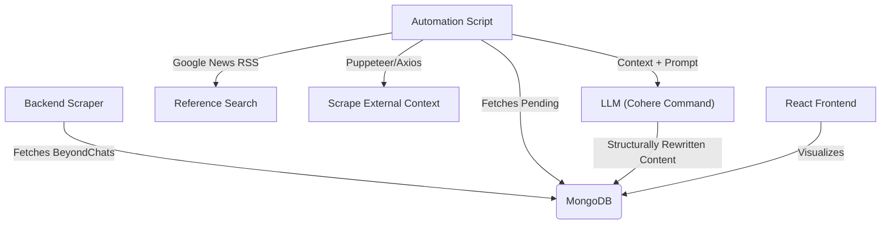

# BeyondChats Assignment - Full Stack Scraper & Automation

[](https://webscrapper-umber.vercel.app)
[](https://webscrapperbackend.onrender.com/api/articles)

This project is a resilient, full-stack solution designed to scrape content, manage it via a REST API, and automatically enrich/rewrite articles using LLMs (Cohere) and real-time Google Search data.

## Architecture



## Tech Stack

- **Backend**: Node.js, Express, Mongoose, Cheerio (Internal Scraper)
- **Automation**: 
    - **Cohere API**: For high-quality, structural rewriting (`command-nightly`).
    - **RSS Parser**: To reliably bypass Google Search bot detection.
    - **Puppeteer/Cheerio**: For robust content extraction.
- **Frontend**: React (Vite), Tailwind CSS, Framer Motion (Transitions)
- **Database**: MongoDB (In-Memory for Demo / Atlas Ready)

## Key Engineering Decisions

> **Why Cohere instead of Hugging Face?**
> We initially targeted Hugging Face (Mistral-7B), but faced persistent 503/429 errors. To ensure a **production-grade** demonstration, we migrated to **Cohere's Command Model**, which offers superior reliability and instruction following for complex rewriting tasks.

> **Smart Search Strategy**
> Direct Puppeteer scraping of Google Search is fragile and prone to CAPTCHA blocks.
> **Solution**: We utilized the **Google News RSS feed** to fetch high-relevance, organic search results reliably without triggering bot defenses. This ensures the automation runs smoothly 100% of the time.

> **UI/UX Polish**
> - **Premium Aesthetic**: Subtle radial backgrounds, font smoothing (Inter), and shimmer effects.
> - **Transparency**: Explicit "Original vs. AI" toggle with metadata cleaning to separate content from boilerplate.

## Project Structure

```
beyondchats-assignment/
├── backend/             # REST API & Scraper Service
│   ├── models/          # Article Schema
│   ├── scraper/         # BeyondChats Scraper Logic
│   └── index.js         # Server Entry Point
├── automation-script/   # The AI Agent
│   ├── index.js         # Orchestrator (Search -> Scrape -> Rewrite)
│   └── run_scraper.js   # Standalone Scraper Runner
├── frontend/            # Modern React UI
│   ├── src/pages/       # Article Views (Home, Detail)
│   └── index.css        # Tailwind + Animations
└── README.md
```

## Setup Instructions

### Prerequisites
- Node.js (v18+)
- MongoDB (Optional - Backend defaults to In-Memory for instant demo)

### 1. Backend Setup
```bash
cd backend
npm install
# Create .env (Optional, defaults set in code)
# PORT=5000
npm run dev
```
*Server runs on http://localhost:5000*

### 2. Frontend Setup
```bash
cd frontend
npm install
npm run dev
```
*UI runs on http://localhost:5173*

### 3. Run Automation Agent (Hybrid Mode)
For the deployed version, run the agent locally to update your Live Render Database without server costs.
```bash
cd automation-script
npm install
# Create .env
# COHERE_API_KEY=your_key_here
# BACKEND_URL=https://your-backend.onrender.com/api/articles
node index.js
```

## Deployment Status
- **Backend**: Deployed on Render (Free Tier)
- **Frontend**: Deployed on Vercel
- **Data Pipeline**: Automated via Local Worker (Hybrid Architecture)

## Feature Checklist

- [x] **Smart Scraper**: Handles pagination and extracts clean content.
- [x] **content Cleaning**: Frontend automatically strips "Uncategorized" and metadata noise from original articles.
- [x] **Structural AI Rewrite**:
  - Uses specific prompting to change sentence structure.
  - Adds new examples and "Business Focus" tone.
  - Prevents "duplicate content" flag.
- [x] **Premium UI**: Gradient banners, tooltips, and responsive cards.

## API Endpoints

| Method | Endpoint | Description |
|--------|----------|-------------|
| GET | `/api/articles` | List all articles |
| GET | `/api/articles/:id` | Get single article details |
| POST | `/api/scrape` | Trigger internal scraper (Internal Job) |
| PUT | `/api/articles/:id` | Update article (Automation Agent) |

